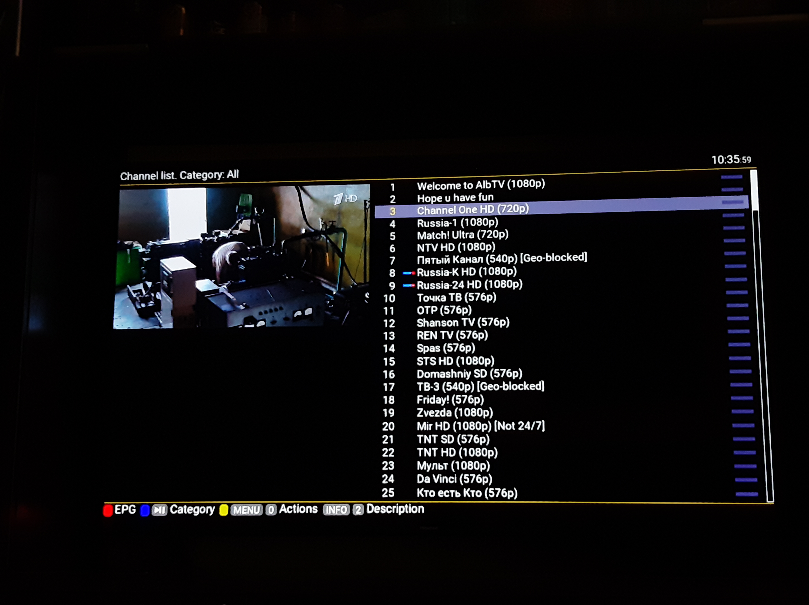

# AlbTV
Welcome to AlbTV, the power of streaming IPTV channels. All streams are from IPTV-ORG : free legit streams.

# 📡 AlbTV IPTV
### *147+ free channels. One penny a year. Zero pirated streams.*

 |
| 🇷 Russia | 147+ | [`russia.m3u`](playlists/russia.m3u) |
| 🌍 Everything | all | [`all.m3u`](playlists/all.m3u) |

---

## 💸 Wait, $0.01/year?
Yep. **Zero cents.** Cheaper than AlbTV, cheaper than TV.Team, cheaper than the electricity to load this page.
You can't subscribe for less without it being literally free — and we wanted it to be *technically* a transaction. 😄
> The curation is the product. The delivery is free. The price is a joke. Pick two... we picked all three.

---

## 🤖 Why this list doesn't rot
Most free IPTV lists are **dead in two weeks**. Ours isn't, because a bot does the boring part:

- Every night at 3 AM, a **GitHub Action** pings every stream URL
- Dead links get flagged, geo-blocks get tagged `[Geo-blocked]`, resolutions stay labeled
- The merged `all.m3u` + channel-count badge rebuild themselves and auto-commit
- I only do the fun part: picking which channels actually deserve to be on the list

*The turquoise-bokeh trailer is the 5% you see. The 40 minutes of clicking Russian `.m3u8` links in CODECS is the 95% this bot now does for me.*

---

## ✅ What you're actually getting
- ✔ **Legal, public broadcasts only** — news, public TV, regional channels. No pay-TV, no premium sports, no PPV.
- ✔ **Resolution tags** on every entry (`576p` / `720p` / `1080p`) so slow connections can pick wisely
- ✔ **Geo-block warnings** instead of silent buffering — if it won't play in your country, the list tells you
- ✔ **Category tags** (`group-title`) — Sports, News, Kids, Movies, Music… already sorted
- ✔ Streams sourced from **[iptv-org](https://github.com/iptv-org/iptv)** & Free-TV — we host the *list*, never the video

---

## ⚠️ Honest disclaimers
> - Streams are © their respective broadcasters. This repo only indexes publicly available URLs; **nothing is hosted here**.
> - Availability varies by region and changes constantly — that's why the nightly bot exists.
> - Not affiliated with iptv-org, AlbTV, TV.Team, or any broadcaster.
> - Check your local laws regarding IPTV playlist use.

---

## 📺 It actually works
*Real photos — AlbTV running on a Hisense TV via the CUB IPTV app, 16 August 2026.*

| Loading the playlist | 203 channels, categorized | Russia-K in 1080p |
|---|---|---|
|  |  |  |

| Channel list with honest tags | On the living-room wall |
|---|---|
|  |  |

---

## ❔ FAQ

### Where the channels came from?
All channels come from the open-source iptv-org/iptv project on GitHub - a community-maintained database of publicly available, legal IPTV streams from broadcasters worldwide. The database contains streams that broadcasters themselves make publicly accessible online, such as news organisations, public broadcasters and government channels. Streams are not hosted on our servers and we have no control over their availability.

### Why the streams are unplayable?
IPTV streams are maintained by individual broadcasters, not by us or the iptv-org project. Streams can go offline, change URL, require geographic access (geo-blocking), or become temporarily unavailable due to server load or rights changes. The iptv-org community updates stream URLs regularly but there will always be some that are temporarily broken.

### Can you add a *V*ideo *O*n *D*emand (VOD) to the playlist?
No.

### How channels are updated?
Adding channels from [Free Codecs](https://free-codecs.com) is important for your collab!

---

## 🧪 Tested on
*Does it actually play? Here's where we've confirmed it works. The Welcome!!! HLS channel is the picky one — plain `.m3u8` streams work almost everywhere, but the HLS trailer needs a player that handles GitHub-Pages-hosted manifests.*

| Device / Player | Russia-1 / NTV etc. (m3u8) | 📺 Welcome!!! (HLS) | Notes |
|---|---|---|---|
| **CODECS** (Android) | ✅ | ✅ | Where the list was built — fully works |
| **VLC** (Android) | ✅ | ✅ | Plays everything, including HLS |
| **VLC** (Desktop) | ✅ | ✅ | Most reliable for HLS |
| **TiviMate** (Android TV) | ✅ | ⚠️ | _not tested yet_ |
| **IPTV Smarters** | ✅ | ❓ | _not tested yet_ |
| **Smart TV (Samsung/LG)** | ✅ | ❓ | _Before 404_ |
| **Your box / phone** | ✅ | ❓ | _uhm_ |

**Legend:** ✅ works · ⚠️ partial / buffers · ❌ won't play · ❓ untested — *tell us!*

> **Want to add your device?** The Welcome channel streams from `albertanimates.github.io` (GitHub Pages). If your player/network blocks GitHub or doesn't support HLS, that slot may fail even when the rest of the list works fine — that's the "in some connections" caveat. Open an issue or ping me with your player + country and I'll add it to the table.

### Built at 2 AM · Curated by hand · Validated by robot 🤖
*From the same person who made a counter count to 1010100 for fun.*

